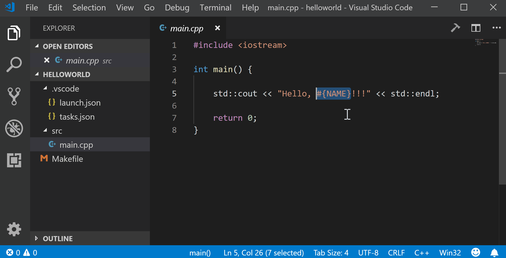

# Project Templates VSCode Extension

[Visual Studio code](https://code.visualstudio.com) extension that allows you to quickly create new projects based on custom templates. 

Inspired by [this File Templates Extension](https://github.com/brpaz/vscode-file-templates-ext), which is itself inspired by [a similar Atom Extension](https://atom.io/packages/file-templates).

## Features

* Create a new project from a template directory
* Save the current project as a template directory
* Use customizable placeholders for easy interactive configuration




## Install

In Visual Studio code, Press F1 to open the command menu and type ```ext install vscode-project-templates```.

## Extension Settings

This extension contributes the following settings:

```ts
{
  "projectTemplates.templatesDirectory": "",          // default directory containing project templates
  "projectTemplates.usePlaceholders": true,           // activate placeholder substitution
  "projectTemplates.placeholders": {  },              // dictionary of default placeholder key-value pairs
  "projectTemplates.placeholderRegExp": "#{(\\w+?)}"  // regular expression to use for detecting placeholders
}
```

## Known Issues

* None

## Release Notes

See [CHANGELOG](./CHANGELOG.md) for release notes.


## Usage

Extension commands can be executed from the Command Palette or from the context menu when selecting a folder.


  

### Creating a Project from a Template

* In VSCode, open a folder that will contain your new project.  Use the Command Palette to execute the command "Project: Create Project From Template".  A list of available templates should appear. Select the desired template.  The contents of the template will be copied to the current root workspace directory.
* If called from the context menu, the contents of the template will instead be copied to the selected folder.

### Saving a Project as a Template

* Create the desired template project in your current root workspace directory.  Use the Command Palette to execute the command "Project: Save Project As Template".  Enter the name for your template.  The contents of your root workspace directory will be copied to a new template folder.
* If called from the context menu, the contents of the selected folder will be copied to the new template folder.

## Placeholders

Variable placeholders can be used in templates in the following way:

```
Author: #{author}
Title:  #{title}
```

When a file is created from a template containing placeholders, the user is prompted for a value to enter.  Placeholders can also be used in filenames.

* Processing of placeholders can be deactivated by setting the extension property 		  
  ```
  "projectTemplates.usePlaceholders": false
  ```
* The format of placeholders is governed by a configurable regular expression which can be set through
  ```
  "projectTemplates.placeholderRegExp":  "#{(\\w+?)}"
  ```
  The first capture group in the regular expression is used to idenfity the placeholder key.
* A set of common placeholder key-values pairs can be specified in a dictionary:
  ```
  "projectTemplates.placeholders": {
	   "author" : "John Smith",
	   "company": "Wonderful Widgets Inc."
  }
  ```
  These placeholders will be replaced without prompting.

## Templates Location

By default, this extension expects the project templates to be placed at the following location, depending of your OS:

Linux:

```
$HOME/.config/Code/User/ProjectTemplates
```

Mac:

```
$HOME/Library/Application Support/Code/User/ProjectTemplates
```

Windows:

```
C:\Users\User\AppData\Roaming\Code\User\ProjectTemplates
```

However, you can change the default location by adding the following to your user or workspace settings:

```
"projectTemplates.templatesDirectory": "path/to/my/templates"
```

### Samples

A set of sample templates can be found [here](https://github.com/cantonios/vscode-project-templates/tree/master/templates)


